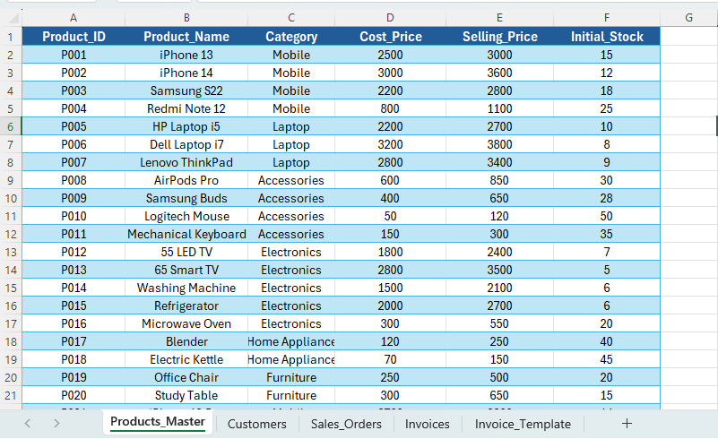
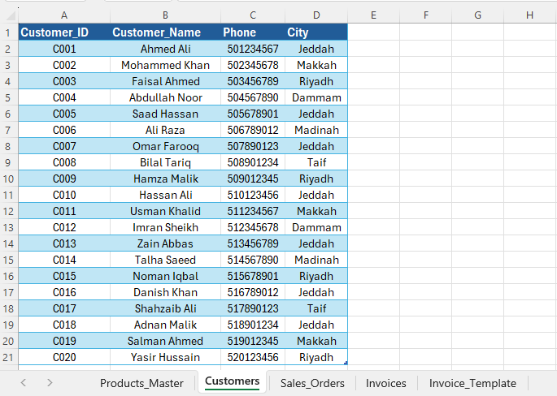
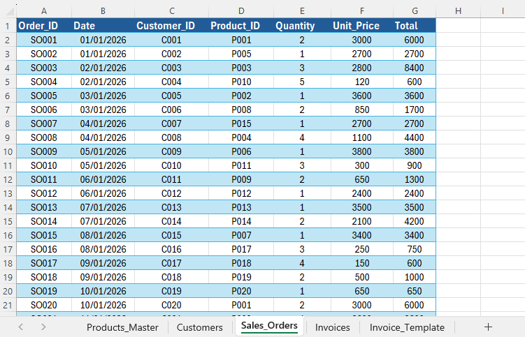
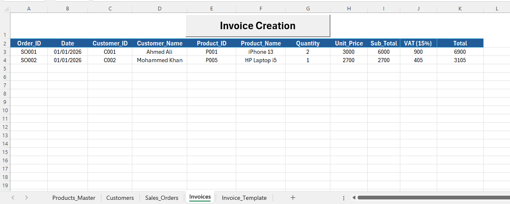
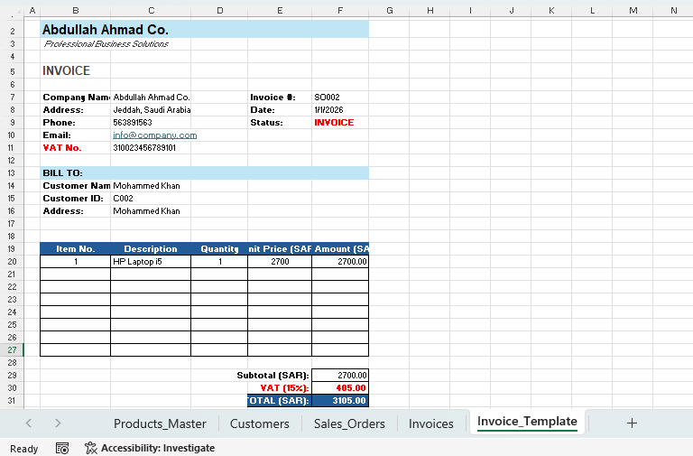

# 📊 Excel ERP System (KSA - Sales, Inventory & Invoicing)
### 🎓 Personal Project

---

## 📑 Table of Contents
- [Overview](#overview)
- [Business Task](#business-task)
- [Dataset Detail](#dataset-detail)
- [Tools & Technologies Used](#tools--technologies-used)
- [Skills Demonstrated](#skills-demonstrated)
- [Project Workflow](#project-workflow)
- [Results](#results)
- [Key Findings](#key-findings) 
- [About this Project](#about-this-project)

---

## 📌 Overview
This project presents a complete **ERP-style system built in Microsoft Excel using VBA**, designed to simulate real-world business operations in the Saudi (KSA) market.  

It integrates **sales management, inventory tracking, customer handling, and VAT-compliant invoicing (15%)**, along with **A4 print-ready invoice generation and PDF export functionality**.

---

## 🎯 Business Task
The goal of this project was to:

- Build a **centralized ERP system** in Excel  
- Automate **sales order to invoice workflow**  
- Implement **VAT (15%) calculation as per KSA standards**  
- Generate **professional A4 invoices**  
- Provide a **user-friendly interface (VBA Form)** for business operations  

---

## 🗂 Dataset Detail

The system is structured into the following Excel sheets:

- **Products_Master** → Product details, pricing, and stock  
- **Customers** → Customer information and contact details  
- **Sales_Orders** → Transactional sales data  
- **Invoices** → Final stored invoice records  
- **Invoice_Template** → A4 formatted invoice layout for printing  

---

## 🛠 Tools & Technologies Used

- Microsoft Excel (.xlsm)
- VBA (Visual Basic for Applications)
- Excel Form Controls (UserForm)
- Data Modeling (Relational Sheets)
- PDF Export Functionality
- A4 Print Layout Configuration

---

## 💡 Skills Demonstrated

- ERP System Design (Excel-based)
- Data Modeling & Structuring
- VBA Automation & UserForm Development
- Data Integration across multiple sheets
- Business Process Automation (Order → Invoice)
- VAT Calculation (KSA - 15%)
- Report & Invoice Generation (A4 + PDF)

---

## 🔄 Project Workflow

1. **Data Setup (Excel)**
   - Created master datasets for products and customers  
   - Defined structured tables for transactions  

2. **Sales Order Management**
   - Entered sales orders with product and customer references  
   - Ensured relational linkage between datasets  

3. **Invoice Form Development (VBA)**
   - Built interactive UserForm for invoice generation  
   - Input: Order ID  
   - Output: Auto-filled invoice fields  

4. **Automation Logic**        
   - VBA retrieves data from Sales_Orders  
   - Maps Customer & Product details from master sheets  
   - Calculates Subtotal, VAT (15%), and Total automatically  

5. **Invoice Storage**
   - Saves invoice records into structured “Invoices” sheet  
   - Maintains consistent invoice numbering  

6. **Invoice Template System**
   - Designed professional A4 layout  
   - Included company details and VAT formatting  

7. **Print & PDF Generation**
   - Syncs form data to template  
   - Generates print preview  
   - Exports invoice as PDF file  

---

## 📊 Results

| 1. Products Master Data |
|------------------------|
|  |
| Structured product data with pricing and stock. |

---

| 2. Customers Data |
|------------------|
|  |
| Customer information used for invoicing and tracking. |

---

| 3. Sales Orders |
|-----------------|
|  |
| Transactional data linking customers and products. |

---

| 4. Invoices Data |
|------------------|
|  |
| Final stored invoices with VAT calculations. |

---

| 5. Invoice Form UI |
|--------------------|
|  |
| VBA-based form for automated invoice generation. |

---

| 6. Invoice Print Preview |
|--------------------------|
|  |
| Professional A4 invoice layout ready for printing. |

---

| 7. Sample Invoice PDF |
|-----------------------|
|  |
| Example of generated invoice in PDF format. |

---

## 🔍 Key Findings

- Excel + VBA can effectively simulate **basic ERP systems**
- Automation significantly reduces **manual data entry errors**
- Structured data modeling enables **scalable system design**
- VAT-compliant invoicing aligns with **real-world KSA business requirements**
- UserForms enhance usability and mimic **professional software systems**

---

## 📘 About this Project

This project was developed as a **real-world business simulation**, focusing on ERP workflows using accessible tools like Excel and VBA.  

It demonstrates the ability to:
- Design systems  
- Automate processes  
- Handle business data  
- Deliver professional outputs  

This project is ideal for roles in:
- Data Analysis  
- Business Intelligence  
- ERP Systems  
- Operations & Process Automation  

---
